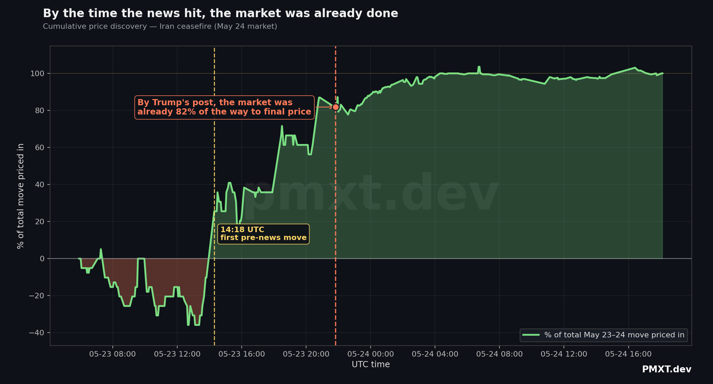
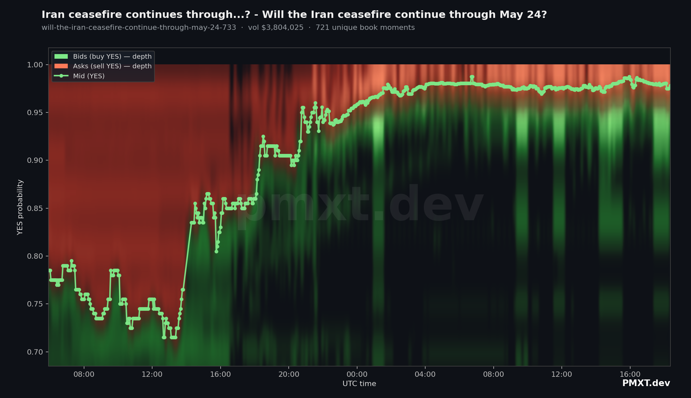
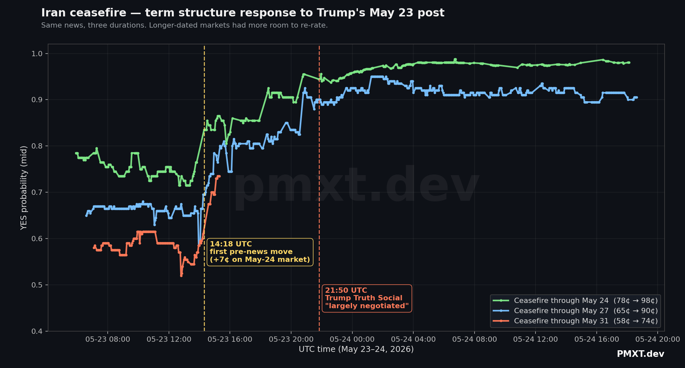
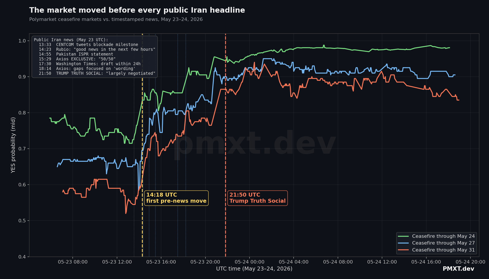
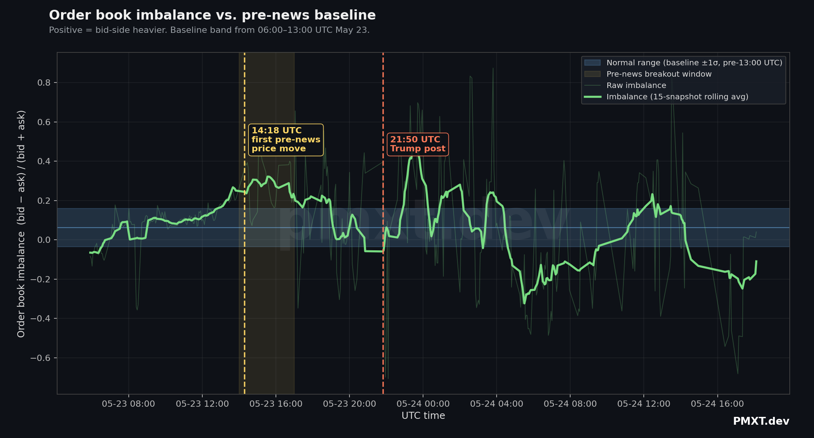
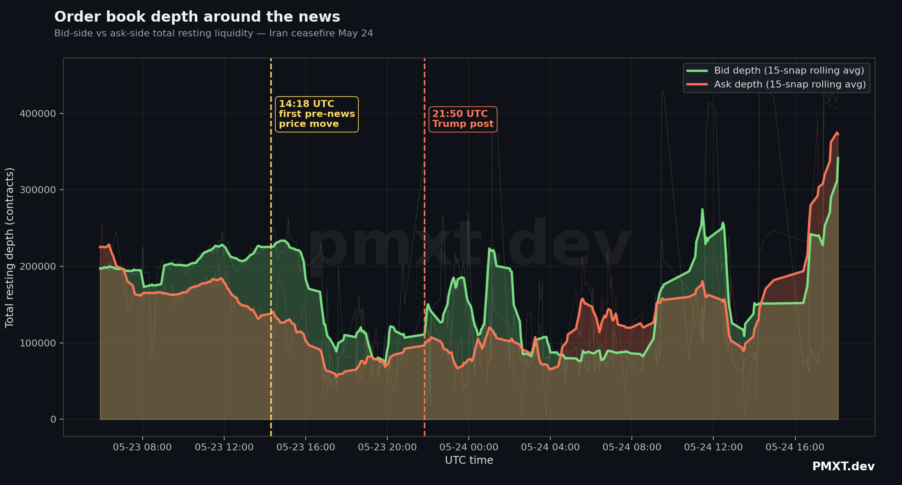

# Polymarket knew before the news did

> Forensic look at the Polymarket order book around the May 23, 2026 US–Iran ceasefire announcement.

## TL;DR

On **May 23, 2026 at 21:50 UTC**, Donald Trump posted on Truth Social that a US–Iran ceasefire agreement had "been largely negotiated, subject to finalization."

By the time the post hit, the Polymarket book for *"Will the Iran ceasefire continue through May 24?"* was already at **95¢ YES**.

It had started the day at **78¢**. The first big move came at **14:18 UTC — 7 hours and 32 minutes before the post**. No public news at that timestamp explains it.

- **Pre-announcement move:** +22¢ (~7.5 hours)
- **Post-announcement move:** +3¢ (next ~6 hours)
- **For every 1¢ the market moved AFTER Trump's post, it had already moved 7¢ BEFORE it.**

This was replicated across three different ceasefire markets (May 24, May 27, May 31 deadlines) — same start time, same direction, same magnitude scaled to duration. Not noise on one market.

All data and code in this repo. Pull it, run it, find things we missed.

---

## The headline chart



By the time the public got the news, the market was 82% of the way to its final price.

## The hero (depth heatmap, May-24 market)



Bid wall (green) below mid, ask wall (red) above. Mid line climbs from 78¢ through 95¢ pre-news, then plateaus at 97-98¢.

## Term-structure across three ceasefire markets



Yellow line = 14:18 UTC first informed move. Red line = 21:50 UTC Trump post. All three markets started rallying within minutes of each other — well before any public news.

## Timeline vs every public Iran headline



Every wire-service / Trump / official statement on Iran for the day, plotted against the price. The 14:18 UTC move beats the earliest positive headline (Rubio's "good news in the next few hours") by 5 minutes — and that headline itself was a leaked-on-purpose hint.

## Order book imbalance vs. baseline



The morning 06:00–13:00 UTC period defines the "normal" imbalance range (blue band). The 14:00–17:00 yellow window shows the breakout — bid-side pressure punching above the band before any news.

## Depth on each side



Bid (green) vs ask (orange) total resting depth.

---

## News timeline (UTC, May 23 2026)

Every public Iran-related signal we could find for the day:

| UTC time | Source | What |
|---|---|---|
| ~11:00 | Trump Truth Social | "United States of the Middle East?" (US flag overlaid on Iran) — *hawkish* |
| 12:03 | State Department | Spokesperson Pigott readout, Rubio–Modi meeting |
| 12:25 | Qatar Amiri Diwan | Emir Sheikh Tamim phone call with Trump |
| 13:33 | CENTCOM | "100 commercial vessels redirected" — blockade milestone (hawkish) |
| **14:18** | **POLYMARKET** | **+7¢ jump — no public news yet** |
| 14:23 | Rubio (New Delhi) | "There may be news later today... good news in the next few hours" |
| 14:55 | Pakistan ISPR | Munir's Tehran trip "highly productive, encouraging progress" |
| 15:23 | Iran MFA | Spokesman: nuclear NOT in initial framework |
| 15:29 | Axios EXCLUSIVE | Trump phone interview: "solid 50/50" |
| 16:06 | CBS | Trump phone interview: "getting a lot closer" |
| 17:30 | Washington Times EXCLUSIVE | "Draft of peace deal within 24 hours" |
| 18:14 | Axios follow-up | "Remaining gaps focused on 'wording'" |
| **18:27** | **POLYMARKET** | **+6¢ jump** |
| **20:45** | **POLYMARKET** | **+4.5¢ jump** |
| **21:50** | **TRUMP TRUTH SOCIAL** | **"An Agreement has been largely negotiated"** |

The 14:18 UTC market move precedes every public positive Iran signal of the day by 5 to 71 minutes.

---

## Data

`data/*.csv` — one file per market. Schema:

| column | type | description |
|---|---|---|
| `snapshot_ts_ms` | int64 | Unix epoch milliseconds (UTC) of the book snapshot |
| `side` | str | `bid` or `ask` |
| `price` | float | YES probability (0–1) |
| `size` | float | Resting contracts at that price |

Files:

| file | market | rows | source |
|---|---|---|---|
| `ceasefire_may24.csv` | Will Iran ceasefire continue through May 24? | ~41K | Polymarket via PMXT |
| `ceasefire_may27.csv` | Will Iran ceasefire continue through May 27? | ~31K | Polymarket via PMXT |
| `ceasefire_may31.csv` | Will Iran ceasefire continue through May 31? | ~34K | Polymarket via PMXT |
| `ceasefire_june30.csv` | Will Iran ceasefire continue through June 30? | ~26K | Polymarket via PMXT |
| `regime_fall_june30.csv` | Will the Iranian regime fall by June 30? | ~23K | Polymarket via PMXT |
| `regime_fall_may31.csv` | Will the Iranian regime fall by May 31? | ~9K | Polymarket via PMXT |

Each row = one resting price level in one snapshot. Multiple rows share a `snapshot_ts_ms` (one per price level on each side).

## Reproducing

### 1. Pull fresh data with PMXT (4 lines of Python)

```python
from pmxt import Polymarket

poly = Polymarket(pmxt_api_key="pmxt_...")
book = poly.fetch_order_book(
    "0xd7540d64e03b1894ececcbb54c02b88d9c5c0e854ba66ec4e1ece20477994ac5",
    params={"since": 1779492000000, "outcome": "yes"},
)
```

This is the only API call you need. `since` is Unix ms (any moment in history), `outcome` is `"yes"` / `"no"`, the first arg is the Polymarket conditionId for the market.

To pull a full window of snapshots: see `scripts/fetch.py` — it loops `fetch_order_book` at a configurable cadence with per-call rate-limiting (85 req/min by default to stay under the 100/min cap).

```bash
pip install pmxt pandas pyarrow scipy matplotlib
PMXT_API_KEY=pmxt_... python3 scripts/fetch.py
```

Sign up at [pmxt.dev](https://pmxt.dev) for an API key.

### 2. Render charts from the data

```bash
python3 scripts/render_heatmaps.py        # per-market depth heatmaps
python3 scripts/render_overlay.py         # term-structure overlay
python3 scripts/render_supporting.py      # cumulative discovery, imbalance, depth
```

### 3. Run the analysis

```bash
python3 scripts/analyze.py
```

Prints top single-step price moves, pre/post-news comparisons, hourly aggregates, spread spikes.

---

## Caveats

- **This is not proof of insider trading.** Several other explanations are plausible: wire-service early reports on Bloomberg/Reuters terminals, diplomatic chat-group leaks, savvy reading of public signals (the Munir Tehran visit, Trump's earlier "United States of the Middle East" post), or just a market that reacts faster than headline news.
- **What this IS:** clear evidence that the market priced ~85% of the news *before* it became headline news. Either someone knew, or prediction markets work *that* well at aggregating private information into public prices. Either reading is interesting.
- **One event.** This investigation looks at a single news cycle in a single set of related markets. No claim is being made about Polymarket trader behavior in general.
- **Sampling cadence.** Book snapshots were taken every 3 minutes — finer-grained data exists in PMXT's archive and might surface even earlier signals.

If you find something we missed, open an issue or @ us.

---

## Credits

- **Markets**: [Polymarket](https://polymarket.com)
- **Historical data API**: [PMXT.dev](https://pmxt.dev) (`@devpmxt`)
- **News timeline**: Reuters, Axios, CBS News, Washington Times, Al Jazeera, ABC News, Pakistani ISPR, AFP, CNN, NBC News, TIME

## License

Data and charts: CC-BY 4.0. Code: MIT.
